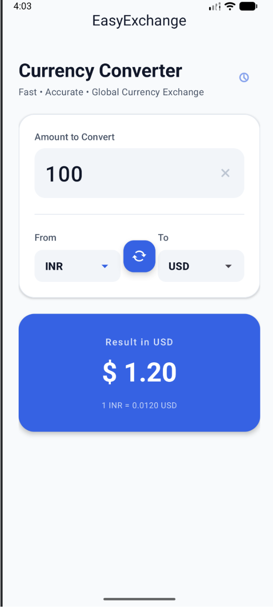
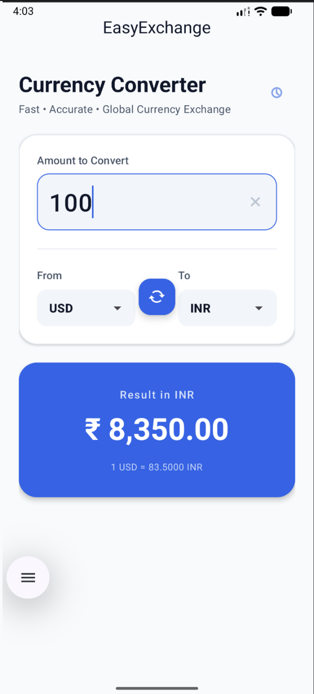

<div align="center">

# 💱 EasyExchange
### Fast • Accurate • Global Currency Exchange

[](https://android.com)
[](https://kotlinlang.org)
[]()

</div>

---

## 📱 Screenshots

<div align="center">

| INR → USD | USD → INR |
|:---:|:---:|
|  |  |

</div>

---

## ✨ Features

- 💰 Real-time currency conversion
- 🔄 One-tap swap between currencies
- 🌍 Supports multiple global currencies
- 📊 Shows live exchange rate below result
- ⚡ Instant conversion as you type
- 🕐 Conversion history log

---

## 🚀 Setup

1. Clone the repo and open in Android Studio
2. Add your Exchange Rate API key
3. Run on device or emulator
```kotlin
const val API_KEY = "YOUR_API_KEY_HERE"
const val BASE_URL = "https://api.exchangerate-api.com/v4/latest/"
```

Get a free API key at [exchangerate-api.com](https://exchangerate-api.com)

---

## 📦 Dependencies
```kotlin
implementation("com.squareup.retrofit2:retrofit:2.9.0")
implementation("com.squareup.retrofit2:converter-gson:2.9.0")
implementation("com.google.android.material:material:1.11.0")
```

---

## 📄 License
MIT License — free to use and modify.

<div align="center">
Made with ❤️ using Kotlin · ⭐ Star if you like it!
</div>
